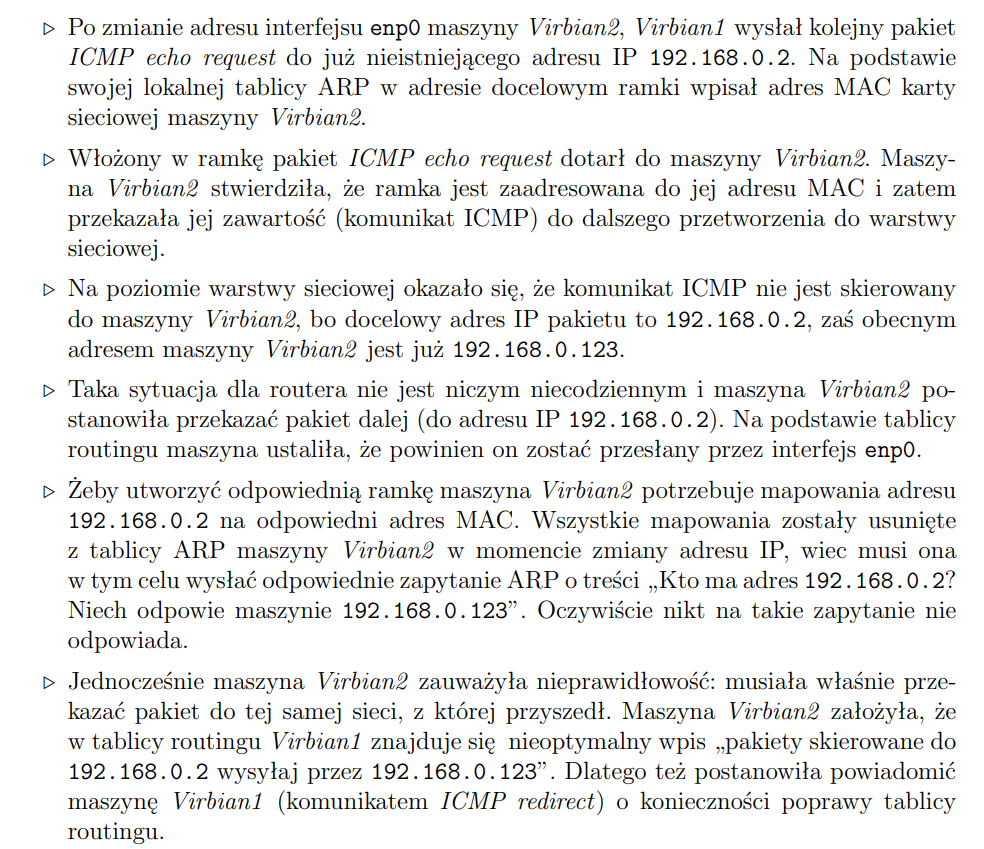

# Warsztaty 5 - Sieci komputerowe

Na początku konfiguracja, V0 połączone przez NAT z kartą fizyczną. V1-V4 połączone local0.

## Tutorial 1

> Protokół DHCP

Pobieramy konfigurację sieciową enp0 uzywając **dhclient enp0**. W WIresharku możemy zaobserwować komunikaty:
- DHCP REquest
- DHCP ACK

Rzeczywiście porozumiewają się protokołami UDP i IP. Adres źródłowy IP wysyłanego paketu to 0.0.0.0.

Usuwamy konfiguracje interfejsu enp0 używając **dhclient -r enp0**.

## Tutorial 2

Na V1 i V2 ustawiam adresy ip i nazwy kartom sieciowym. Odpalamy wiresharka.

Poleceniem **ip link** wyświetlam adresy mac kart sieciowych na obu maszynach. Pinguje z V1 maszyne V2 - ping 192.168.0.2.

W wiresharku dla ramki ethernetowej mamy pola:
- nadawcy - PcsCompu_d4:48:27
- odbiorcy - PcsCompu_d4:a4:ee

W zawartym pakiecie IP mamy pola:
- nadawcy - 192.168.0.1
- odbiorcy - 192.168.0.2

## Tablica ARP
Na V1 oglądamy tablice ARP używając **ip neigh**. Widzimy tam enp0 z napisem STALE.

Następnie usuwamy wszystkie wpisy **ip neigh flush all**. To samo na V2.

Z V1 ponownie pingujemy V2. Rzeczywiście V1 najpierw wysyła zapytanie ARP, otrzymuje opdowiedź i następnie wysyła komunikaty ICMP echo. Stan maszyn zmienił się, bo:
- na V1 pojawił się spowrotem w tablicy ARP enp0 i mamy teraz **REACHABLE** zamiast STALE
- na V2 pojawił się spowrotem w tablicy ARP enp0 i mamy teraz **STALE** znow

### Bliżej ARP
#### Co jest danymi ramki w ARP?
- Destination MAC- ff:ff:ff:ff:ff:ff (broadcast)
- Source Mac - MAC maszyny V1

#### Gdzie są wysyłane zapytania ARP?
Są wysyłane na adres rozgłoszeniowy (broadcast)

#### Gdzie wysyłane są odpowiedzi ARP?
Są wysyłane spowrotem do komputera naszego do enp0.

### Podsumowanie

Widzimy więc, że po usunięciu tablicy sąsiedztwa ip neigh, V1 wysyła zapytanie ARP w celu ustalenia jaki adres MAC ma IP V2. To zapytanie idzie w ramce ethernet jako broadcast.

## Tutorial 3
> Bezstanowość protokołów

Na V1 pingujemy V2 i pozostawiamy je działające. WIdzimy w wiresharku oczywiście pakiety ICMP echo request i echo reply. 

Podczas pingowania zmieniamy na V2 adres ip na 192.168.0.123, poleceniem **ip addr del 192.168.0.2/24 dev enp0 && ip addr add 192.168.0.123/24 dev enp0**

### Co zaobserwowałem
Redirect od 192.168.0.123. Wydaje się, że V2 po zmianie adresu IP próbuje wysłać informacje do V1, że doszło do zmiany IP i że ma poprawić tablicę routingu.

### CO się wydarzyło

