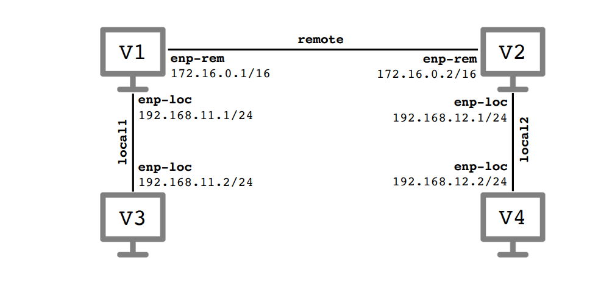

# Warsztaty 2 - notatki z tutorialu

## Tutorial 1

### Konfiguracja
Po połączeniu kart sieciowych:
- virbian1 do sieci wirtualnych remote i local1
- virbian2 do sieci wirtualnych remote i local2

Wpisując **ip link** widzimy 3 interfejsy sieciowe na każdej z maszyn:
- lo - interfejs pętli lokalnej
- enp0s3 - sieć remote
- enp0s8 - sieć local1/local2

Możemy zmienić nazwy interfejsów komendą **ip link set enp0s3 name enp-rem** - taka komenda zmienia enp0s3 na enp-rem. Analogicznie dla local.

Aktywujemy karty enp-rem za pomocą: **ip link set up dev enp-rem** Możemy sprawdzić czy działa(**sudo ethtool enp-rem**). Następnie przypisujemy adres ip za pomocą: **sudo ip addr add 172.16.0.1/16 dev enp-rem**

### Tablica routingu
Wyświetlamy tablicę routingu: **ip route**.

Sprwadzamy pingiem czy maszyny widzą się wzajemnie w sieci remote, np w Virbian1: **ping 172.16.0.2** - adres ip enp-rem na virbian2

Rzeczywiście robiąc ping 127.0.0.1 (do lo) działa, a nie wyświetla się w ip route. Dodatkowe tego typu wpisy uzyskujemy za pomocą **ip route list table local**

Po włączeniu wireshark na obu maszynach i nasłuchiwaniu na any, obserwujemy co jest wypisywane w konsoli i jakie pakiety są odbierane i wysyłane przy pingowaniu z Virbian1:
- adresu 127.0.0.1 - w Virbian1 widzę że wysyłamy ping echo do 127.0.0.1, w wiresharku widzę również w Virbian1, w Virbian2 nic.
- adres enp-rem dla Virbian1 - identyczny efekt jak w przypadku 127.0.0.1
- adres enp-rem dla Virbian2 - tu robi się ciekawiej, oba wiresharki wyłapują request i reply. Widzimy całość, co więcej po zamknięciu ctrl+c wiresharki pokazują wiersze z protokołem **ARP**(Adress resolution protocol), w których są pytania **Who has 172.16.0.2? Tell 172.16.0.1** i vice wersa oraz odpowiedzi **172.16.0.2 is at 08:00:27:07:32:84** i vice versa
- 172.16.255.255 (z -b) - na obu virbianach widzimy echo request reply, ale przy request mam (no response found)
- 172.16.0.0 - wysyłamy ping do adresu IP nie przypisanego do żadnego interfejsu sieciowego, w obu virbianach widać protokół ARP z pytaniem **Who has 172.16.0.0? Tell 172.16.0.1**, i tylko na Virbian1, który ma ten adres 172.16.0.1 mamy odpowiedź w ICMP, Destination unreachable(host unreachable)
- 10.10.10.10 - odpowiedź **ping: connect: Network is unreachable**

## Tutorial 2
Wykonujemy tę samą pracę co w Tutorialu1 ale z Virbian3 oraz Virbian4 aby osiągnąć pożądany efekt

Na każdej maszynie robimy **sysctl net.ipv4.ip_forward** i na każdej maszynie dostajemy 1, czyli na każdej maszynie mamy włączone przekazywanie pakietów IP pomiędzy interfejsami (każda maszyna może pełnić role routera).

Przy użyciu ping sprawdzamy nabliższe maszyny i widzimy że wszystkie śmigają.

Przy próbie sprawdzenia maszyn dalszych, poza siecią wirtualną, np. z Virbiana1 osiągnięcie enp-loc na Virbianie2 rzeczywiście dostajemy błąd **ping: connect: Network is unreachable**. Nadawca nie wie jak dostać się do docelowej sieci.

Naprawimy to dodając wpisyw tablicach routingu:
- Na virbian1: **ip route add 192.168.12.0/24 via 172.16.0.2** (do 192.168.12.0 dostaniesz się przez 172.16.0.2)
- Na virbian2: **ip route add 192.168.11.0/24 via 172.16.0.1** (do 192.168.11.0 dostaniesz się przez 172.16.0.1)

Przy pomyłce komendy można skasować trasę wpisując zamiast add, del.

Po aktualizacji tablicy routingu ping działa poprawnie.

Jednak dalej mamy problem że np z Virbian1 nie udostajemy odpowiedzi od 192.168.12.2 (enp-loc na Virbian4). Wydaje mi się że wynika to z tego, że Virbian1 potrafi trafić do Virbian4, natomiast Virbian4 nie potrafi odpowiedzieć do Virbiana1.

Aby to naprawić Virbianowi4 nadajemy informację, że jeśli pakiety dostarczymy do interfejsu enp-loc podłączonego do Virbiana2, to mogą dotrzeć w dowolne miejsce, zajmie się tym Virbian2. Robimy to za pomocą komendy: **ip route add default via 102.168.12.1** (default oznacza 0.0.0.0), analogicznie robimy dla Virbian3 żeby oddelgowywał do virbiana1:  **ip route add default via 102.168.11.1** 
