# Wyzwanie - Warsztaty 2 - Maciej Dengusiak

## Krok 1 - konfiguracja
Poprzez ustawienia każdej z maszyn w trybie expert w zakładce network konfigurujemy kolejne karty sieciowe połączone z wirtualnymi sieciami opisanymi w wyzwaniu.

## Krok 2 - nazwy interfejsów
Uruchomiłem wszystkie maszyny.

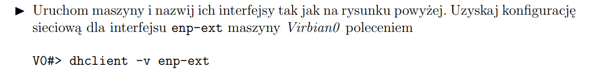

Nazywamy kolejne interfejsy jak na rysunku komendą **ip link set 'stara_nazwa' name 'nowa_nazwa'**. Dla rysunku z wyzwania komendy będą wyglały następująco.

### Virbian0

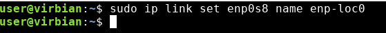

### Virbian1
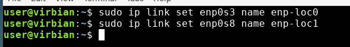

### Virbian2
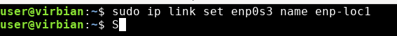

Aby upewnić się, że dobrze nazwałem interfejsy, użyłem komendy **ip link**. Przykład z virbiana 1 na którym widać już nowo ustawione nazwy kart sieciowych.

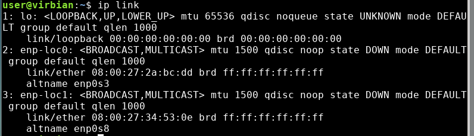

### Konfiguracja sieciowa enp-ext

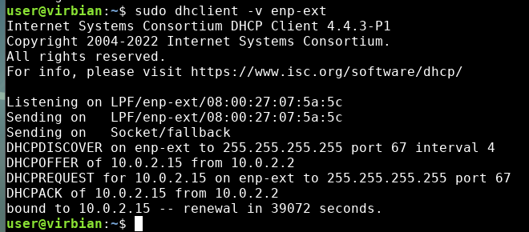

## Krok 3 - przypisanie IP
Każdą kartę aktywuję poleceniem **ip link set up dev 'nazwa'** a następnie przypisuje adres IP poleceniem **sudo ip addr add 'IP' dev 'nazwa'**.

### Virbian0

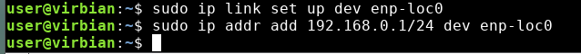

### Virbian1

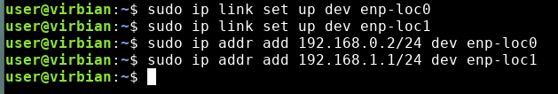

### Virbian2

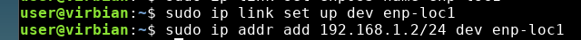

### Sprawdzenie pingiem

Z każdej maszyny sprawdziłem osiągalność intefejsów bezpośrednio połączonych maszyn. Poniżej przykład sprawdzenia osiągalności Virbiana2 z Virbiana1.   

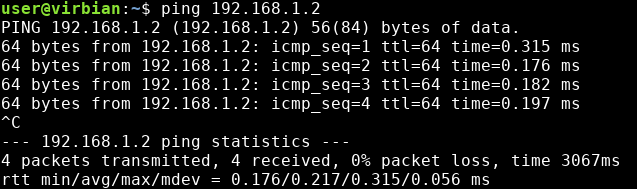

## Krok 4 - konfiguracja routingu

### Virbian0

Określamy, że do sieci 192.168.1.0/24 można dostać się wysyłając pakiety do 192.168.0.2

### Virbian1

Ustawiamy bramę domyślną równą 192.168.0.1

### Virbian2

Ustawiamy bramę domyślną równą 192.168.1.1

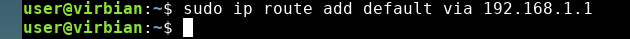

## Krok 5 - test osiągalności interfejsów

Sprawdzimy czy z każdej maszyny są dostępne wszystkie interfejsy. Poniżej przykład sprawdzenia pingiem osiągalności Virbiana2 z Virbiana0, czyli IP 192.168.1.2 z Virbian0.

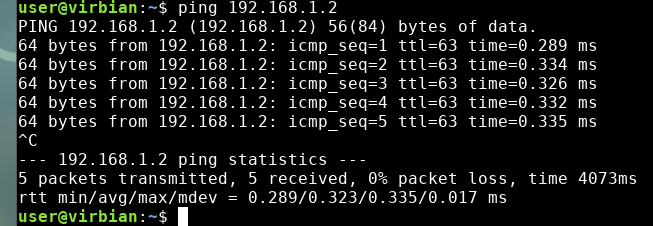

Trasa z maszyny Virbian2 do maszyny Virbian0 przy pomocy traceroute.

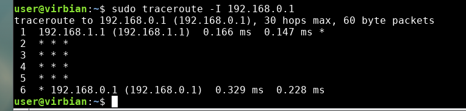

## Krok 6 - ping 8.8.8.8

### Virbian0

Otrzymujemy odpowiedź oraz podglądając wiresharki odpowiedź widzimy wyłącznie na maszynie Virbian0.

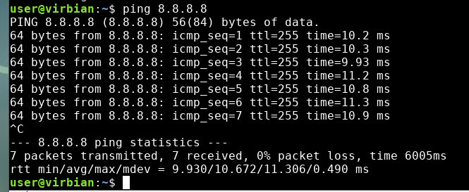
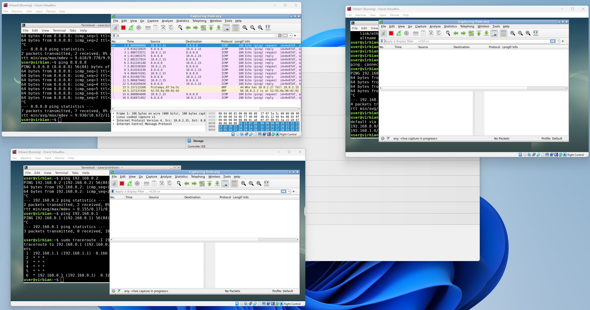

### Virbian2

W przypadku pingowania z Virbiana2 zapytanie dochodzi do do maszyny Virbian0 co obserwujemy w wiresharku. Nie otrzymujemy za to odpowiedzi. Wynika to z tego, że Vibian2 jest w lokalnej sieci, google nie wie o jego istnieniu i nie potrafi odesłać odpowiedzi. Żeby odpowiedź wracała do Virbiana2 trzebaby powiadomić google o konfiguracji naszej sieci. 

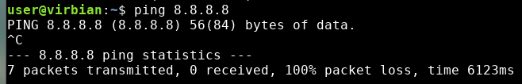
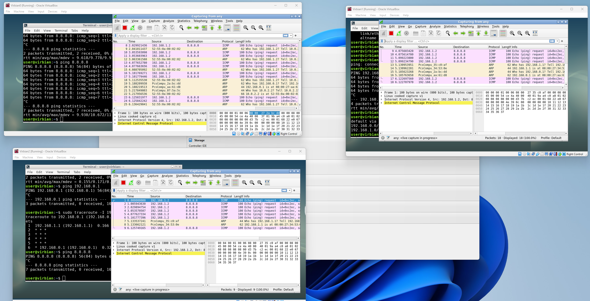