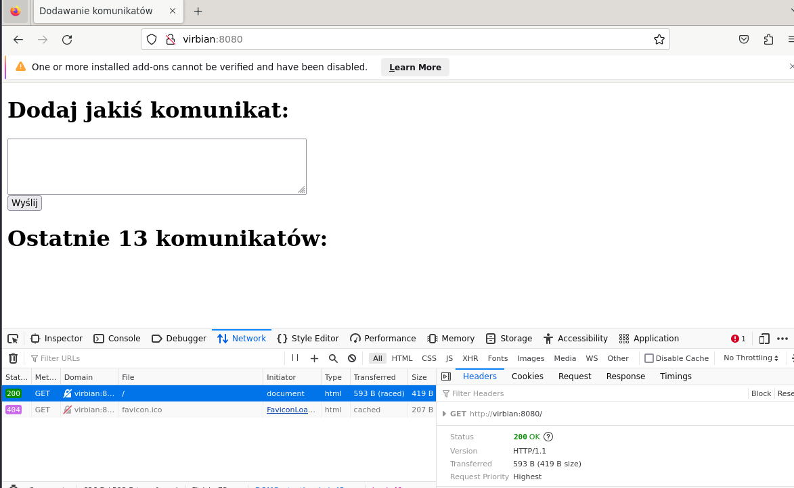
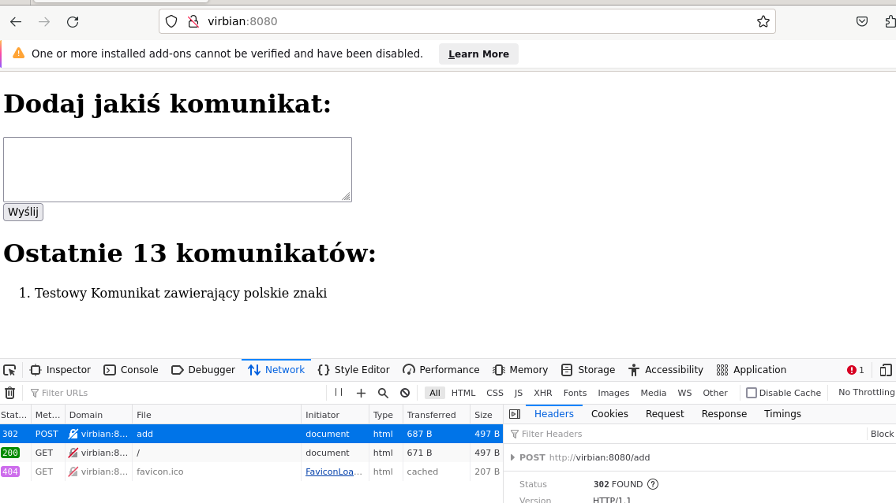
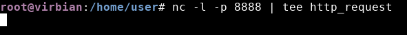
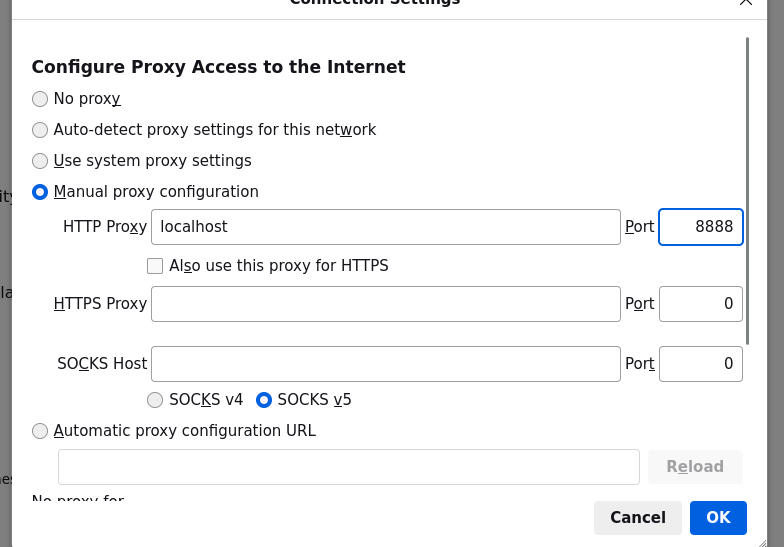
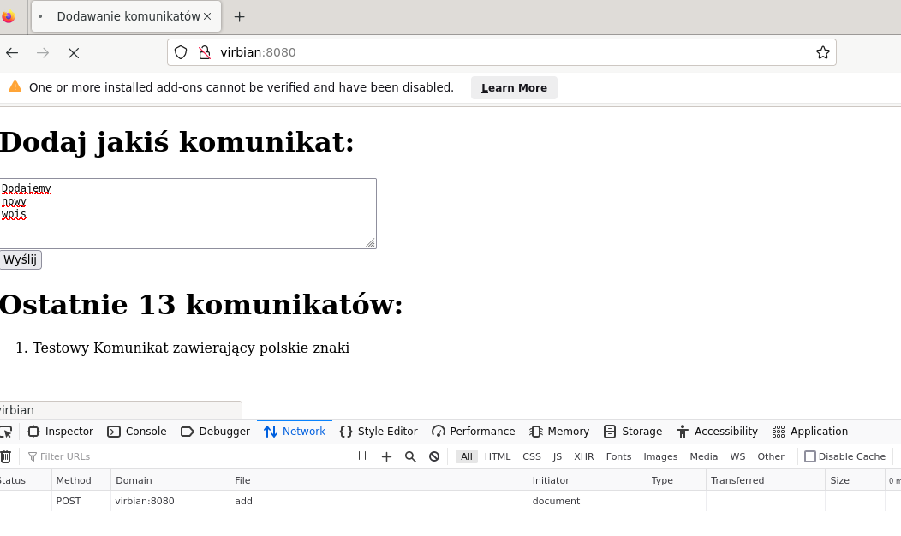
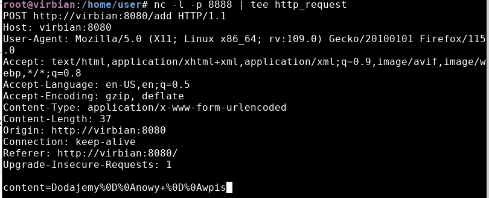
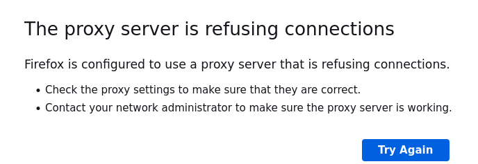
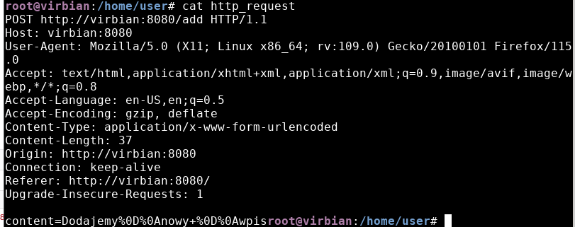
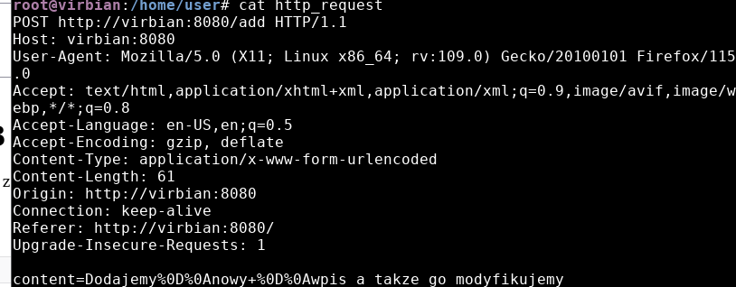
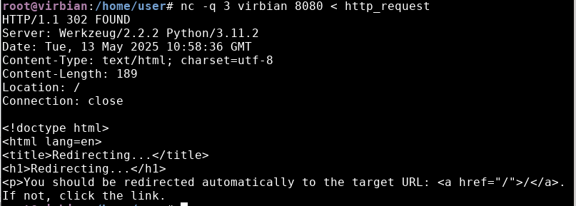

# Sieci komputerowe - Warsztaty 6 - wyzwanie

Będziemy dodawać nowy wpis na stronie WWW za pomocą **nc**.

## Krok 1
Uruchamiamy usługę serwera WWW wyświetlającego prostą stronę do dodawania wpisów używając **systemctl start hydepark**.

## Krok 2
Odpalamy devtools w firefoxie na karcie Network. Wchodzimy na stronę **http://virbian:8080/**. W Devtoolsach możemy podejrzeć komunkację między serwerem a przeglądarką, obejrzeć nagłówki, treść zapytania, odpowiedzi, zaznaczając Raw nawet surowe zapytanie odpowiedź bez parsowania.

\pagebreak
## Krok 3
Co się dzieje jak dodaje wpis w formularz na Virbian:8080? 

Wysyła się POST do virbian:8080/add z polem content równym mojemu wpisowi. Dostajemy odpowiedź **302 Found**, z polem Location /. 

## Krok 4
Uruchamiamy program nc w trybie serwera TCP na porcie 8888, używając **nc -l -p 8888 | tee http_request**

\pagebreak

## Krok 5 
W menu przeglądarki->Settings->Network settings->Connection settings->Manual proxy configuration ustawiamy:
- w polu HTTP proxy wartość localhost
- w polu Port wartość 8888

\pagebreak
## Krok 6
Po zaakceptowaniu ustawień wysyłamy na Virbian:8080 znów jakiś wpis.

Rzeczywiście przeglądarka zachowuje się jakby oczekiwała na odpowiedź a wpis nie zostaje dodany. 

Wydaje mi się, że to jest spowodowane tym, że ustawiliśmy proxy w przeglądarce jakko localhost na porcie 8888. A tym proxy jest nasz nasłuchujący serwer TCP poprzez program nc. Przeglądarka oczekuje więc odpowiedzi od serwera TCP a on nie odpowiada. 

\pagebreak
## Krok 7
Przerywamy działąnie nc. Widać że automatycznie przeglądarka przestaje czekać na odpowiedź, dostajemy komunikat **The proxy server is refusing connections**.

W http_request program nc zapisał oczywiście zapytanie z przeglądarki - POST do add z parametrem content.

Cofamy ustawienia proxy w przeglądarce.

## Krok 8
Wysyłamy zapytanie do serwera WWW poleceniem **nc -q 3 virbian 8080 < http_request**. Odpowiedni komunikat został dodany na stronę.

\pagebreak

## Krok 9 
Modyfikujemy plik http_request poprzez zmianę contentu i modyfikację content-length. 

Wysyłamy na serwer zmieniony http_request.

\pagebreak

Odpowiedni komunikat znów został dodany na stronę.

## Krok 10
Dezaktywujemy działanie serwera WWW i dezaktywujemy kartę i wyłączamy maszynę.